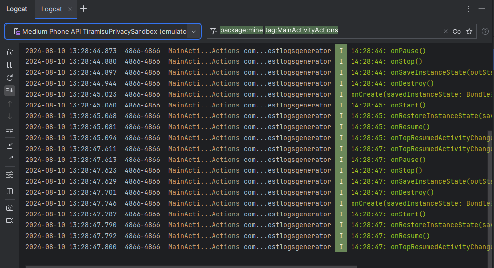
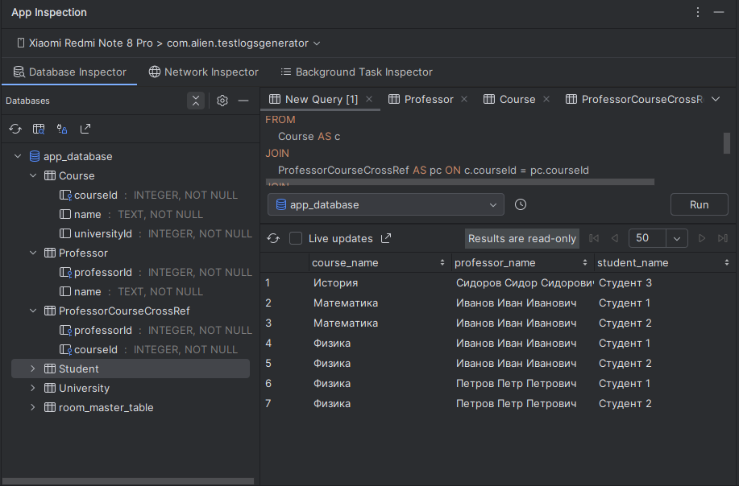

# Android Studio для QA

Android Studio — интегрированная среда разработки (IDE) для работы с платформой Android. Сама по себе она содержит огромное количество инструментов, которые могут использоваться для разработки, отладки и тестирования приложений на Android. Здесь же опишем основные инструменты, которые могут пригодиться в работе QA. 
Само приложение можно скачать здесь: https://developer.android.com/studio.

## Инструменты, которые будут рассмотрены ниже:
- [Сборка проекта и git](#build_and_git)
- [Logcat](#logcat)
- [Эмуляторы и Device Manager](#emulator)
- [Профайлер](#profiler)
- [AppInspector](#app_inspector)

## Сборка проекта и git

Сборка проекта и работа с git чаще всего нужна, когда вы пишите автотесты. Однако, это не значит, что если в вашем проекты вы не занимаетесь автотестами, то вам не нужен доступ к коду. Хоть и многие и функции ниже работают без доступа к коду, однако, доступ к коду расширяет возможности инструментов. А система контроля версий позволяет проанализировать изменения внесённые разработчиком, подмечая какие места в приложении могли быть затронуты и на что нужно обратить отдельное внимание. Также у вас будет всегда возможность при необходимости самостоятельно собрать ветку проекта для тестирования. 

\* Примечание, Android Studio умеет работать не только с git, но и с другими системами контроля версий: [Version control basics ](https://developer.android.com/studio/projects/version-control). Здесь не привожу детальных инструкций по работе с git, если у вас возникли трудности попросите помочь разработчику или поищите ответ самостоятельно.

Для запуска сборки скачайте и откройте проект из вашего репозитория, переключитесь на нужную ветку, подключите девайс к компьютеру (убедитесь что разрешили отладку по usb) или создайте эмулятор, затем нажмите на зелёную стрелочку в верхней панели – run. Документация: [Build and run your app](https://developer.android.com/studio/run)

<figure><figcaption></figcaption></figure>

## Logcat

Logcat в Android Studio – один из основных инструментов QA инженера. Он позволяет смотреть в реальном времени и анализировать логи вашего приложения. С помощью них можно найти какие ошибки возникают в приложении, понять из-за чего происходит краш или почему какая-то функция не работает. А помогает в этом система фильтров и другие инструменты настройки визуализации. Записанные логи можно экспортировать для того, чтобы приложить к баг-репорту, а также импортировать, для удобного анализа с помощью фильтров. Logcat также содержит дополнительные инструменты позволяющие снимать запись экрана, останавливать процессы и др. Подробнее про возможности Logcat можно прочитать тут: [Подробное руководство по Logcat в Android Studio с примерами](https://habr.com/ru/articles/818751/).

Если говорить про важность доступа к коду, то когда именно ваш проект открыт в студии, то можно применять удобный фильтр package:mine, оставляющий логи всех ваших пакетов (особенно удобно, когда их много), а также в окне логов отображается информация о запуске и остановке вашего приложения.

<figure><figcaption></figcaption></figure>

## Эмуляторы и Device Manager

Эмуляторы позволяют имитировать на вашем компьютере реальные устройства (подробнее: [Симуляторы и эмуляторы](mobilnoe-testirovanie/simulyatory-i-emulyatory.md)). Android Studio позволяет создать эмуляторы множества различных устройств использующих Android, такие как часы, тв-приставки и так далее, а не только смартфоны. Эмуляторы можно использовать для тестирования, когда под рукой нет реального устройства с нужной версией Android или определёнными характеристиками. Либо при тестировании специфических кейсов, таких как работа с смс (на эмуляторы, с помощью adb, можно отправлять смс от любого номера). Создать виртуальное устройство можно в окне Device Manager, нажав иконку с плюсиком и выбрав Create Virtual Device. Далее мастер установки поможет вам выбрать характеристики устройства, скачать образ системы и задать остальные параметры, такие как объём доступной оперативной памяти, диска и разрешение и dpi экрана. 

Официальная документация по созданию и запуску эмулятора: [Create and manage virtual devices](https://developer.android.com/studio/run/managing-avds).

 Device Manager – позволяет управлять подключенными к Android Studio девайсами. Здесь отображают как установленные эмуляторы, так и девайсы подключенные по adb (кабелем, по wifi или удалённо по сети), а также девайсы из фермы устройств предоставляемых Firebase (нужно зарегистрировать приложение в сервисе и вы получите бесплатные минуты для работы с ними ([Квоты потоковой передачи на устройствах Android](https://firebase.google.com/docs/test-lab/usage-quotas-pricing?hl=ru#device-streaming)). Отсюда можно управлять параметрами эмуляторов: запускать и останавливать их, очищать память, редактировать параметры. Кроме управления эмуляторами, здесь можно открыть проводник файлов устройства, вывести демонстрацию экрана с подключенного устройства в окно Running Devices. Также отсюда вы можете подключить эмулируемые часы к смартфону.

 

Окно Running Devices позволяет видеть, что происходит на экране подключенного устройства (в том числе эмулируемого), а также удалённо управлять им с помощью мышки. Если открыт эмулятор, то в меню действий появится кнопка (выделено стрелкой), которая открывает дополнительные действия доступные для эмулятора. Здесь можно задать фейковое местоположение, уровень заряда аккумулятора, статус сети, позвонить на устройство и многое другое.

## Профайлер

Профайлер позволяет следить в реальном времени за потреблением ресурсов смартфона вашим приложением. Вы можете следить за потреблением CPU и RAM, а также при необходимости записать детальную трассировку в которой будет даже информация о потреблении батареи и дампы памяти. Чтобы открыть расширенную статистику и иметь возможность записать её, необходимо нажать на соответствующий график (CPU или Memory). Профайлер позволяет следить не происходят ли нежелательные для пользователя расходование ресурсов, которое может вести к падению производительности приложения, либо его остановке.

 

У профайлера есть два режима работы, один – debuggble позволяет собрать более детальную информацию, однако debug сборка приложения сама потребляет много ресурсов, так что картина может отличаться от той, что у пользователей. Для того, чтобы решить эту проблему Android Studio рекомендует переключиться на второй режим – profileable, она работает начиная с 10 версии android. По сути это релизная сборка приложения со специальным параметром в манифесте. 

Для того чтобы получить такую сборку вам надо иметь доступ к коду и выбрать в меню действий (троеточие) рядом со стрелкой запуска проекта пункт "Profile app with low overhead (profileable)" – проект соберётся с новыми параметрами. Либо вам нужно будет попросить разработчика собрать вам такую сборку или настроить ci/cd для сборки.

Документация по работе с профайлером: [Profile your app performance](https://developer.android.com/studio/profile)

## AppInspector

AppInspector включает в себя несколько инструментов для анализа вашего приложения. Он позволяет вам исследовать базы данных вашего приложения, отправлять sql запросы к ним и делать выборки, посредством [Database Inspector](https://developer.android.com/studio/inspect/database). Также здесь есть возможность следить за фоновыми процессами – [Background Task Inspector](https://developer.android.com/studio/inspect/task) и за сетевым трафиком – [Network Inspector](https://developer.android.com/studio/debug/network-profiler). Однако, в случае последнего, всё же рекомендую пользоваться снифферами трафика, так как по моим наблюдениям Network Inspector может показывать не все сетевые запросы.

 
