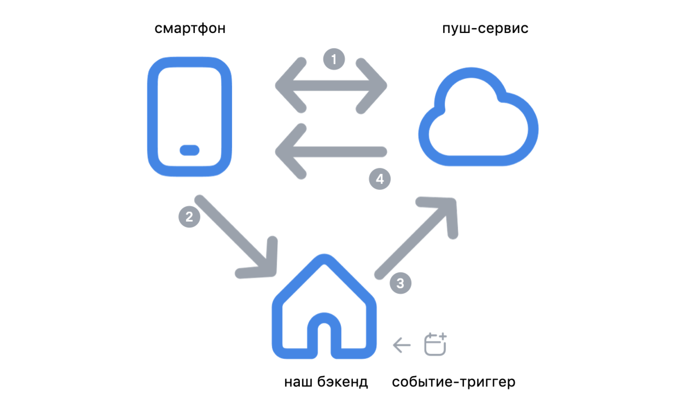

# Тестирование push-уведомлений

**Push-уведомления** — это сообщения, отправляемые на мобильное устройство клиента. Они обычно используются для доставки обновлений продуктов, напоминаний, персонализированных предложений, последних новостей и любой информации, которая является неотъемлемой частью функциональности приложения и требует особого внимания или быстрых действий.


Важно! Не путайте уведомления и push.

**Уведомление** – это всплывающая плашка, звук, значок – элемент интерфейса призванный обратить на себя внимание пользователя. Чтобы показать уведомление, приложению не нужно ничего, оно может показать информацию без подключения к интернету, напомнить вам о каком-либо событии и всё в этом духе. Триггером для показа уведомления может быть что угодно, внутренняя логика приложения, таймер, или же push-сообщение.

**Push** – пуш это сообщение! Сообщение в специальном формате , которое должно быть обработано на телефоне. Оно приходит через специального посредника – сервиса пуш-сообщений через интернет. Обычно им выступает сервис от производителя операционной системы (APNS - Apple, FCM - Google, HMS - Huawei) но также могут использоваться альтернативные поставщики пушей. Как правило пуши нацелены на то, чтобы показать вам уведомление, однако это совсем не обязательное условие, и пуши могут быть неотображаемые и нужны приложению для обновления какой-нибудь внутренней информации.

Иными словами пуш может быть уведомлением, а может не быть, а уведомление может быть пуш-уведомлением, а может локальным (или внутренним, реализуемый по внутренней логике приложения в обход пуш-сервера).


### **Принцип работы push-уведомлений**

* Пользователь устанавливает ваше  приложение на устройство и запускает его;
* 1 – приложение регистрируется в службе push-уведомлений и получает у него токен — уникальный идентификатор устройства;
* 2 – приложение передает полученный токен на ваш сервер;
* 3 – сервер шлет уведомления в службу push-уведомлений при наступлении определенного события, вместе с полученным токеном;
* 4 – служба push-уведомлений по токену находит ваше устройство и отправляет push на него, , где служба сервиса принимает его и решает как поступить (показать, отложить или разбудить ваше приложение для обработки пуша).

<figure><figcaption></figcaption></figure>

<details>

<summary>Массовые push-сообщения</summary>

Кроме точечных сообщений существуют также массовые, в этом случае приложение подписывается на конкретный тип пушей (топик) из которого сообщения будут отправляться на конкретный девайс автоматически, а наш бэкенд только отправляет сообщения в конкретный топик. Подробнее [документация для fcm (android)](https://firebase.google.com/docs/cloud-messaging/android/send-multiple) и [документация для APNS](https://developer.apple.com/documentation/usernotifications/sending-broadcast-push-notification-requests-to-apns) (работает начиная с 18 iOS).

</details>

Доставка push-сообщений даже, когда ваше приложение выключено, осуществляется за счёт того, что службы push-уведомлений постоянно подключены к своим серверам, не убиваются системой и имеют право "разбудить" ваше приложение.

В случае iOS уведомления работают через облачную платформу APNS (Apple Push Notification Service).

Если говорить о решении пуш-уведомлений от Android, то есть несколько вариантов. Самый простой способ действовать — использовать Firebase Cloud Messaging (FCM) для устройств Android с Google Apps. Если у ваших пользователей есть устройства Huawei (а именно, без Google Apps), то для работы пушей на таких устройствах необходимо будет также поддержать работу с HMS (Huawei Push Kit), используя Huawei Push Kit.

Конечно, вы также можете создать собственного провайдера push-уведомлений или использовать готовые проекты, поскольку платформа имеет открытый исходный код.

Стоит отметить тот факт, что решения для Android (как Firebase Cloud Messaging, так и Huawei Push Kit) можно использовать как прокси к пушам на iOS, позволяя работать с пушами из одной точки входа с единым API.

### Разница между push-уведомлениями в iOS и Android

iOS основана на модели push Opt-In, которая не позволяет брендам отправлять мобильные push-уведомления пользователям своих приложений до тех пор, пока эти пользователи не согласятся их получать.

Начиная с 13 версии Android также добавил необходимость приложениям получать разрешения на показ уведомлений. До 13 версии Android по умолчанию разрешает пользователям получать push-уведомления с возможностью отказаться от них вручную. Что давало более широкую аудиторию пользователей с поддержкой push. Однако, когда у пользователей нет возможности легко отказаться от их получения, нерелевантные или слишком частые уведомления могут подтолкнуть клиентов отключить сообщения или удалить приложение.

Тут нужно отметить тот факт, что речь касается именно показа уведомлений, но так называемые тихие (silent) push-сообщения всё ещё будут приходить на устройство и "будить" ваше приложения для обработки сообщения, несмотря на запрет уведомлений.

<details>

<summary>Виды push-сообщений на примере FCM</summary>

Как отмечалось выше FCM позволяет отправлять пуши как на Android так и на iOS.&#x20;

**Пуши бывают нескольких видов:**

* **Базовый (notification messages)** – такое пуш-уведомление, содержит поле - notification, в котором можно указать только title, body, image . Оно показывается автоматически, когда приложение в фоне или выключено, если же приложение открыто, то ничего не будет показано.&#x20;

```
  {
  "message": {
    "token": "bk3RNwTe3H0:CI2k_HHwgIpoDKCIZvv...",
    "notification": {
      "title": "Breaking News",
      "body": "Something exciting just happened!",
      "image": "https://example.com/news-image.jpg"
    }
  }
}
```

* **Data** - пуши с полем data, в которое вы можете добавить собственные данные в формате ключ-значение, без поля notification. При получении такого сообщения система разбудит ваше приложение, чтобы оно его обработало. Ничего автоматически не показывается. Пуш доставляется до приложения в любом случае, приложение уже само реагирует на него, может показать уведомление, а может не показать.

Особенность, о которой многие не знают – такой пуш придёт и разбудит приложение даже, если пользователь **не** **дал разрешение** на показ уведомлений (потому что как уже писал пуш – это вам не уведомление).

```
{
  "message":{
    "token":"bk3RNwTe3H0:CI2k_HHwgIpoDKCI...",
    "data":{
      "name" : "Арман",
      "body" : "Этот пуш никогда не покажется",
      "silent" : "true",
      "anything" : "Что угодно",
      ...
    }
  }
}
```

* Гибридные пуш-сообщения, **Базовый + Data** – содержат оба поля и notification и data, логика работы здесь зависит от состояния приложения в момент получения пуша.
  * Приложение в фоне или выключено - уведомление отрисовывается автоматически, используя только данные из поля notification, а данные из data будут переданы приложению, только, если пользователь нажмёт на уведомление.
  * Приложение на переднем плане - fcm передаст приложению весь пайлоад сразу и не будет ничего автоматически показывать.

</details>

<details>

<summary>Виды уведомлений</summary>

* Пуш-уведомления – собственно, то о чём говорили выше.
* Локальное-уведомление – приложение само инициирует показ уведомления по своей внутренней логике, не обращаясь к бэкенду.
* Собственная логика показа уведомлений – можно назвать подтипом для локальной логики, ниже примеры. Здесь приложение может как обращаться к бэкенду, так и нет:
  * моментальный показ уведомлений, когда приложение включено
  * показ уведомлений в периоды, когда система будит приложения в сервисных целях, тут в том числе приложение может обратиться к бэкенду
  * некая запланированная активность по показу уведомлений используя сервисы системы, например для андроид [WorkManager ](https://developer.android.com/topic/libraries/architecture/workmanager)или [AlarmManager](https://developer.android.com/reference/android/app/AlarmManager)
* Постоянно висящее уведомление, позволяющее сохранять постоянное соединение с вашим бэкендом или информирующее о другой активности приложения.

Если у вас нет уверенности используется ли та или иная технология, вид уведомления или пуша в вашем приложение, то стоит уточнить это у разработчиков и задокументировать в базе знаний.

Понимание логики работы приложения, не только в контексте пушей - ключ к составлению правильных проверок при тестировании, и нахождению причин проблем.

</details>

### Тестирование push-уведомлений


Если у вас на проекте только вводят push-уведомления или вы обнаруживаете много проблем с их доставкой в первую очередь обратитесь к официальной документации провайдеров push-сообщений. Так как у них есть множество ограничений и условий (такие как время жизни пуша, приоритет и т.д.), неправильная настройка какого-либо параметра может сделать так, что почти все push не будут доходить или будут приходить с запозданием.


<details>

<summary>Ссылки на документацию сервисов</summary>

* [FCM](https://firebase.google.com/docs/cloud-messaging/concept-options)
* [APNS](https://developer.apple.com/documentation/usernotifications/sending-notification-requests-to-apns#Know-when-to-use-push-types)
* [HMS](https://developer.huawei.com/consumer/en/doc/HMSCore-Guides/funtion-description-0000001050148080)

</details>

**Не приходят push-уведомления**: Чтобы разобраться в причине, для начала проверьте, чтобы в меню устройства была активирована соответствующая функция (разрешены уведомления для конкретного приложения). Затем убедитесь, что не включен режим «Не беспокоить». Если всё настроено правильно, но уведомления не приходят, попробуйте перезагрузить устройство и заново авторизоваться в приложении. Токен push-сервиса мог протухнуть и приложению необходимо получить его вновь. Или на вашем сервере не происходит регистрация или удаляется полученный токен. Совместно с backend вашего сервиса проверьте, корректность регистрации устройства, а также ответ API службы push-уведомлений (FCM, APNS или др.). Проверьте также, какой стиль уведомления используется (необходим «Баннер» либо «Предупреждение»). Если не помогло всё перечисленное, попробуйте перезайти в свою учетную запись магазина приложений, либо откройте саму программу, в том случае, если на другие приложения тоже не приходят push-уведомления (стоит также проверить наличие интернета на устройстве).

**Переходы по push-уведомлению**: При тестировании необходимо проверить такие сценарии (с учётом того, что пользователь может быть авторизован или неавторизован):

* переход по push-уведомлению с заблокированного экрана;
* переход по push-уведомлению из «шторки»;
* пользователь находится в приложении;
* переход по push-уведомлению при свёрнутом приложении;
* пользователь разлогинился после получения push;
* переход по push-уведомлению с включенным «Don't keep Activities» (характерно для Android-приложений).

Существуют push-уведомления, которые ведут на определенный экран с выбором определенных фильтров. В таком случае необходимо проверить, что переход осуществляется на правильный экран. Если это был поисковой запрос, то проверьте, что текст поискового запроса отображается в строке поиска и выдача товаров соответствует поиску. Также могут передаваться определенные фильтры, в таком случае необходимо проверить, что выбраны все «зашитые» фильтры.

Если push-уведомление ведет на WebView, то проверьте, что WebView открывается корректно на обеих платформах. И что в push зашит корректный URL.

**Устаревший push-токен**: У устройства изменился push-токен, когда восстановили приложение из резервной копии системы и не передался новый push-токен.

**Ограничения со стороны службы push-уведомлений**: Google и Apple не гарантируют доставку push, есть множество параметров, которые могут повлиять на скорость доставки пуша. Например, Google может уменьшить приоритет push-сообщений, если большая часть push-сообщений не отображается в виде уведомлений. Также на скорость доставки push может повлиять большая очередь на доставку со стороны служб.

**Проверка максимального и минимального количества отображаемых символов**: В iOS и Android имеется лимит отображаемых символов. Он разный. Максимальное значение количества символов для платформы iOS - ограничение в 4 строки (178 символов), а для Android — не более 13 строк (663 символа). Не забудьте также проверить push-уведомление, содержащее минимальное количество символов, для обоих платформ можно задать 1 символ.

**Кастомный звук для push-уведомления**: При тестировании push-уведомлений важно учитывать тот факт, что звук push-уведомления может быть задан кастомный. В таком случае необходимо проверять и звуковое сопровождение нотификации.

**Изображения в push-уведомлениях**: Push-уведомление может содержать изображение, при отправке пуша — клиент получает ссылку на изображение и перед показом загружает его, далее происходит процесс обогащения пуша картинкой - она устанавливается. Уведомление отображается после загрузки картинки. Если push-уведомление содержит картинку, необходимо проверить, что она отображается.

**Локальные уведомления**: Локальные уведомления планируются самим приложением и служат для своевременного и актуального информирования пользователей, пока приложение не работает на переднем плане. Чтобы уведомление отобразилось, его необходимо запланировать самому пользователю. В таких случаях проверяем кейсы, связанные с таймингом отправки сообщения.

**Проблемы на серверной стороне**: В другие приложения приходят push-уведомления, но не приходит на наше, хотя push-токен отправлен на сервер. Стоит проверить корректность отправки push на другие аккаунты сервиса и другие устройства. При отсутствии push-уведомлений сообщите команде серверной разработки.

**Мультиаккаунт**: Если в вашем приложние реализована возможность входа в несколько аккаунтов, крайне важно тщательно изучить какое должно быть поведение push при входе в несколько аккаунтов. Должны ли приходить push со всех или только с активного аккаунта. Если да нужно проверить коректность переключения аккаунтов при открытии push, а также, что пользователю понятно для какого аккаунта пришёл push. Если push не должны приходить для не активных аккаунтов, то следует проверить корректность перерегистрации аккаунта на сервере и/или push-токена (в зависимости от выбранной логики) при переключении аккаунтов.

### Как узнать, что push-сообщения не доходят до устройств пользователей

Наличие систем наблюдения и статистики позволит вам быстрее реагировать на новые проблемы, а также анализировать эффективность доставки пушей, тем самым улучшая пользовательский опыт.

Есть два решения из которого можно взять статистику:

* **Статистика от push-провайдера** – имеет как преимущества так и недостатки. Например, [агрегированный формат](https://firebase.google.com/docs/cloud-messaging/understand-delivery?platform=android#aggregated_delivery_data_via_the_data_api) и [BigQuery для детального анализа](https://firebase.google.com/docs/cloud-messaging/understand-delivery?platform=android#bigquery-data-export) от FCM или для iOS девайсов [статистика от APNS](https://developer.apple.com/documentation/usernotifications/viewing-the-status-of-push-notifications-using-metrics-and-apns). Однако, они не могут предоставить информацию об открытиях пушей, не все события будут записаны (например, если пользователь запретил сбор статистики), а также есть сложности в анализе конкретных проблем.
* Второй вариант это **собственная система аналитики** (либо интеграция сторонних решений), когда ваше приложение само сообщает информацию на ваш бэк с информацией о том, что пуш был доставлен.
  * Такое решение позволяет получить подробную статистику о пушах, провести детальную трассировку от сервера до устройства, возможность реализовать больше бизнес-требований. Например, можно отслеживать не только пуши, но и в целом все виды уведомлений, которые у вас показываются, считая общую эффективность доставки сообщений, не зависимо от источника.\
    &#x20;

Источники:

* [Руководство по тестированию push-уведомлений](https://habr.com/ru/articles/811297/)
* [Тестирование push-уведомлений в мобильных приложениях](https://habr.com/ru/company/youla/blog/553762/)
* [Механизм пуш-уведомлений для iOS и Android](https://macdays.ru/soft/mehanizm-push-uvedomlenij-dlya-ios-i-android/)

Доп. материал:

* [Отправка push-уведомлений с помощью Firebase Cloud Messaging](https://medium.com/nuances-of-programming/%D0%BE%D1%82%D0%BF%D1%80%D0%B0%D0%B2%D0%BA%D0%B0-push-%D1%83%D0%B2%D0%B5%D0%B4%D0%BE%D0%BC%D0%BB%D0%B5%D0%BD%D0%B8%D0%B9-%D1%81-%D0%BF%D0%BE%D0%BC%D0%BE%D1%89%D1%8C%D1%8E-firebase-cloud-messaging-66e329fdfdc2)
* [Отправка push-уведомлений в приложение для iOS с помощью облачных сообщений Firebase](https://code.tutsplus.com/ru/tutorials/get-started-with-firebase-messaging-for-ios--cms-32126)
