# Тестирование WebSocket на клиентах

Для тестирования всех фич работающих через сеть на клиентах (особенно мобильных) необходимо использовать снифферы трафика, такие как Charles, Fiddler, Proxyman и др. Они умеют перехватывать запросы, позволяют изменять их и настраивать автоматическую замену различных параметров согласно правилам. Однако, ситуация становится сложнее, когда речь доходит до тестирования WebSocket  на тех же клиентах (в том числе web).

Есть множество инструментов с помощью, которых можно протеcтировать сам WebSocket, тот же Postman может выступать в роли клиента. Но, когда нам нужно протестировать как клиент реагирует на различные сообщения в нём, то возможности популярных снифферов сильно ограничены позволяют лишь просматривать сообщения в WebSocket c различным качеством удобства.&#x20;

Если на проекте у вас есть инструмент со стороны бэкенда, способный отправлять собственные сообщения в веб-сокет или менять отравляемые и принимаемые сообщения со стороны, то возможно этого будет достаточно для проверки различных кейсов на клиентах. Таких как тестирование кастомных ответов от сервера, эмулирования ошибок. Когда бекенд не готов или на проде воспроизвести ситуацию трудно, а протестировать как будет вести клиент себя в этой ситуации нужно.

Если такого инструмента нет, то придётся прибегнуть к альтернативным решениям, способным уже не только показывать, но и перехватывать и изменять сообщения отправляемые в WebSocket.

Ниже рассмотрим два решения, которые позволят покрыть большинство кейсов, связанных с WebSocket.

* [Burp Suit](testirovanie-websocket-na-klientakh.md#burp-suit)
* [ZAP proxy](testirovanie-websocket-na-klientakh.md#id-instrumentytestirovaniyawebsocketnaklientakh-zapproxy.1)

| Burp Suite                                                                                                                                                                                                                                                | ZAP Proxy                                                                                                                                                                                                                              |
| --------------------------------------------------------------------------------------------------------------------------------------------------------------------------------------------------------------------------------------------------------- | -------------------------------------------------------------------------------------------------------------------------------------------------------------------------------------------------------------------------------------- |
| 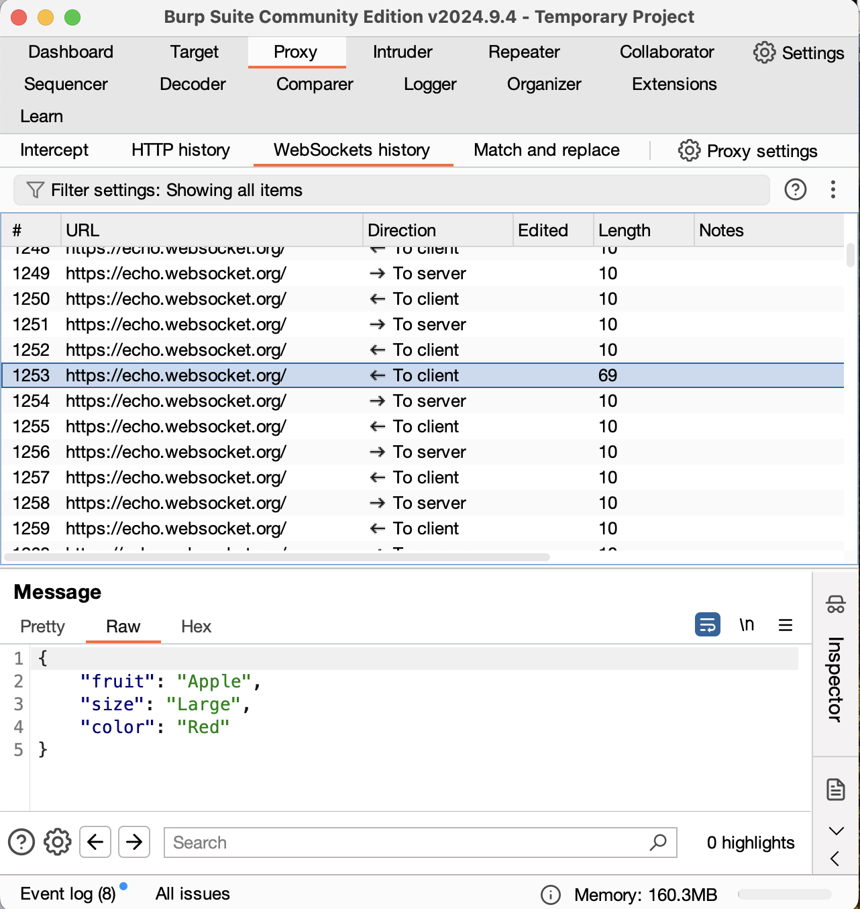                                                                                                                                                                            | 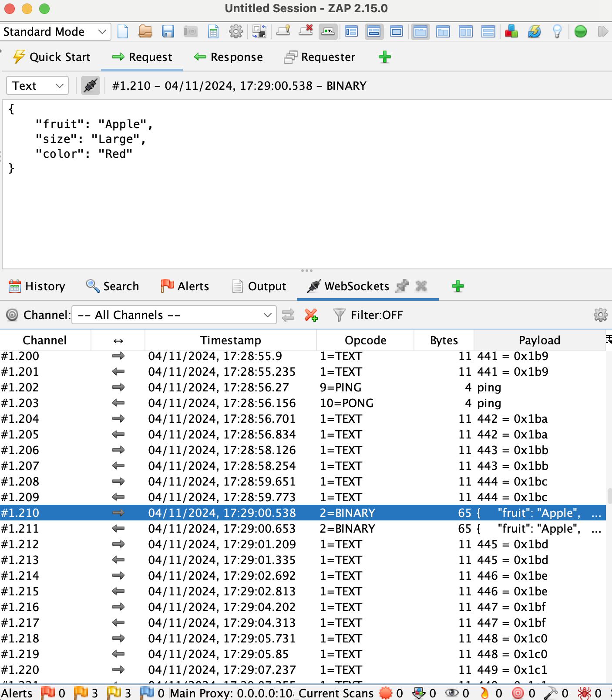                                                                                                                                                         |
| 
Бесплатной версии хватит для выполнения основных задач. Не показывает Ping/Pong сообщения (или не получилось найти как включить)

<a href="https://portswigger.net/burp/communitydownload">https://portswigger.net/burp/communitydownload</a>
 | 
Опенсурсное приложение, местами удобнее Burp при работе с ws, хотя есть и свои минусы. Плюс больше возможностей.

Скачать можно на сайте <a href="https://www.zaproxy.org/download/">https://www.zaproxy.org/download/</a>
 |

## Burp Suit

***

При запуске нас просят выбрать проект.

В бесплатной версии можно работать только с временным проектом, однако для работы с WebSocket этого достаточно, все настройки можно экспортировать в файл конфигурации и применить на следующем экране.

### **Proxy**

Третий экран уже будет окно самого Burp, открываем сразу вкладку  **Proxy**:

<figure>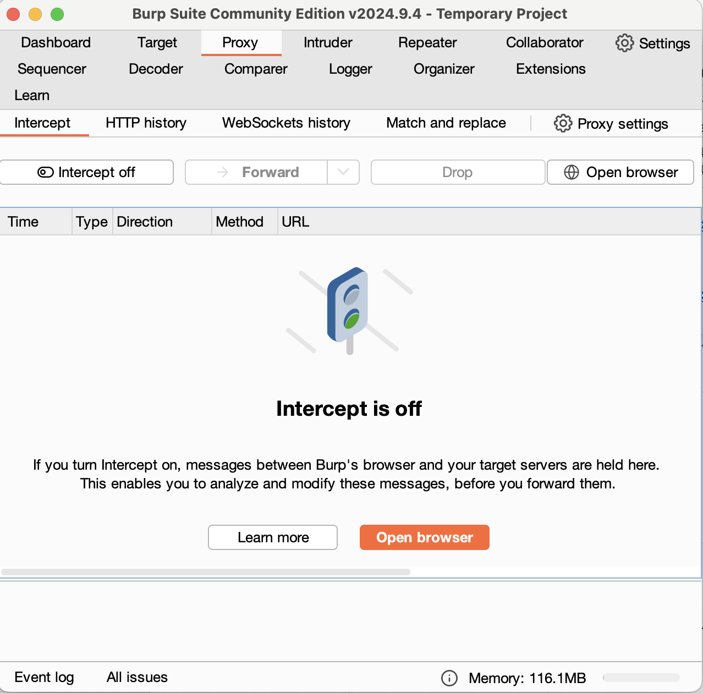<figcaption></figcaption></figure>

Здесь будет 5 вкладок/кнопок.

* **Intercept** – по сути тоже что брейкпоинты, при включении будет перехватывать все запросы соответствующие правилам заданным в настройках (об этом ниже).
* **HTTP history** – история HTTP запросов.
* **WebSockets history** – история сообщений внутри всех Websocket соединений. У каждого соединения задается в рамках сессии свой id – число, чтобы можно было их отличать.
* **Match and Replace** – можно быстро включать и отключать правила автозамены для запросов HTTP и сообщений в WebSocket. Дублирует тоже самое из настроек.
* **Proxy Setting** – настройки прокси.

### **Настройки – Proxy Settings** 

Начать надо с настроек.

<figure>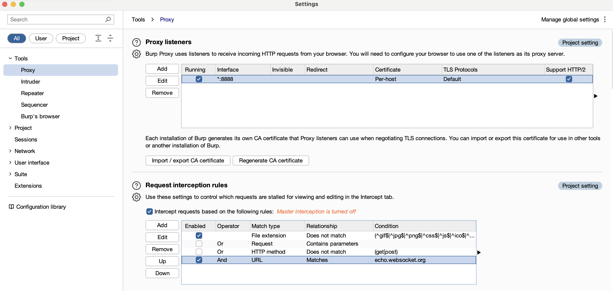<figcaption></figcaption></figure>

Если проксируем мобильные клиенты, то надо разрешить все входящие соединения, для этого выбираем единственную строчку в **Proxy listeners** и жмём edit. Там прописываем свой порт и меняем **Bind to address** на **All interfaces**&#x20;

<figure>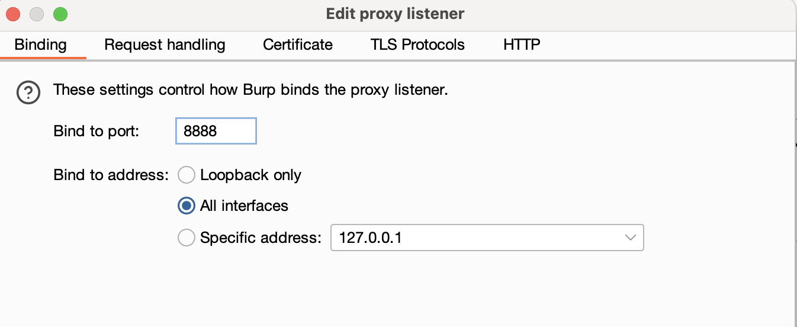<figcaption></figcaption></figure>

Экспортируем сертификат

* нажимаем **import / export CA certificate** внизу блока **Proxy listeners;**
* там выбираем **Certificate in DER format;**
* **Select file** и тут надо вручную ввести любое название и расширение .der
* Устанавливаем сертификат на смартфон или на компьютер (смотря где собираетесь смотреть), аналогично как это делали с другими снифферами.

#### **Request interception rules**

Здесь задаём правила для перехвата (брейкпоинтов). Burp автоматически перехватывает всё, что подходит условиям. Так как нам надо перехватывать только сообщения из вебсокета добавляем сюда правило **operator** – AND, **match type** – URL, **relationship** – Matches, а в **condition** пишем URL нашего сервера с ws.

<figure>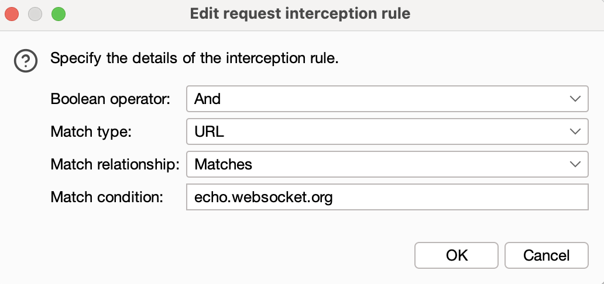<figcaption></figcaption></figure>

В правом верхнем углу: **троеточие – project setting – save** (тут также надо самому вписать имя файлу и расширение, можно .json)

Сохраняем настройки в файл, чтобы при следующем включении burp выбрать его и не настраивать снова.

<figure>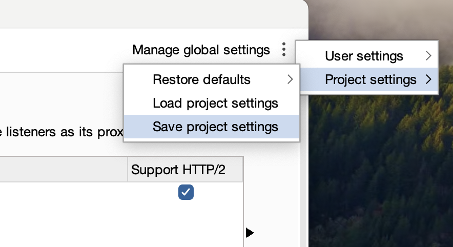<figcaption></figcaption></figure>

### **WebSockets history – просмотр сообщений**

Здесь можно просто смотреть какие сообщения ходят в WebSocket, сортировать по дате, id сокета и т.д.&#x20;

При нажатии на запрос внизу открывается окно с телом сообщения.

<figure>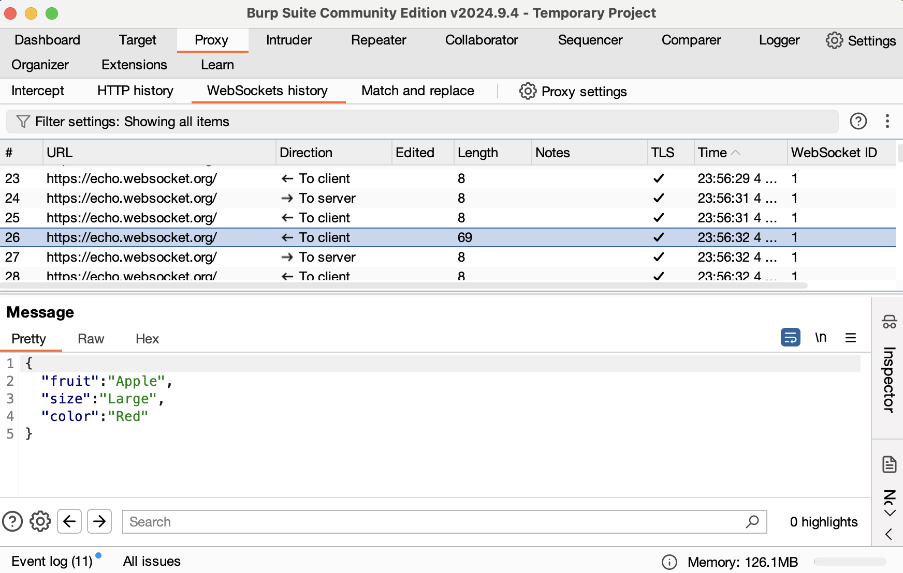<figcaption></figcaption></figure>

### **Intercept – перехват сообщений**

В настройках мы прописали, что надо перехватывать только запросы с адресом вебсокета, поэтому тут теперь просто нажимаем на переключатель: 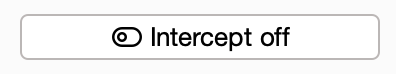

После этого все запросы будут перехватываться и попадать в окно интерсептора, где его можно менять, для отправки нажимаем 

<figure><figcaption></figcaption></figure>

### **Repeater – отправка сообщений в websocket** 

При тестировании вебсокетов нужно кроме перехвата также смотреть кейсы, когда клиенту приходят различные сообщения от вебсокета и как он их обрабатывает. Это удобнее делать напрямую отравляя сообщения в вебсокет клиенту от имени сервера (или наоборот, если понадобиться)

Нажимаем в истории вебсокета правую кнопки мыши на любом запросе в активный вебсокет и выбираем **send to repeater.** Дальше переключаемся на это вкладку (на том же уровне, где и Proxy).

<figure>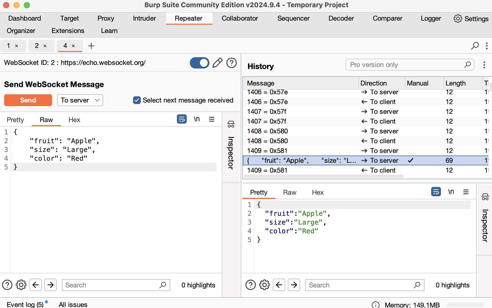<figcaption></figcaption></figure>

Слева будет окно, куда можно написать своё сообщение, а справа история запросов в websocket.

Здесь также можно оборвать соединение нажав на тумблер.

<figure>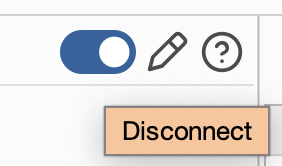<figcaption></figcaption></figure>

Можно отправить и редактировать при необходимости в виде Hex. Это полезно если в контракте есть необходимость отправлять конкретные байты вместо текста.

## **ZAP Proxy** 

***

Основные преимущества ZAP перед Burp при работе с websockets:

* показывает PING/PONG сообщения
* при отправке сообщения в websocket можно самостоятельно выбрать тип сообщения (text, binary, ping, pong, close)

Из минусов брейкпоинты обрабатываются последовательно, нельзя увидеть следующий пока не отправишь текущий (ну или я и тут не нашёл где посмотреть). Ну и интерфейс немного старомодный, но по удобности также плох как Burp.

### **Настройки**&#x20;

Чтобы открыть настройки переходим **ZAP > Settings** или **Tools > Options**

При необходимости язык можно поменять на русский в разделе **Languages.** Применится после перезагрузки.

Переходим в **Network**

#### Local Servers/Proxies 

Адрес оставляем 0.0.0.0 если надо проксировать все входящие соединения.

Порт пишем тот, который используем.

<figure>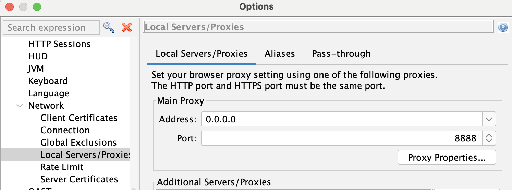<figcaption></figcaption></figure>

#### Server Certificates

Генерируем сертификат (Generate), а потом сохраняем его (Save). Устанавливаем также как и для любых других снифферов.

<figure>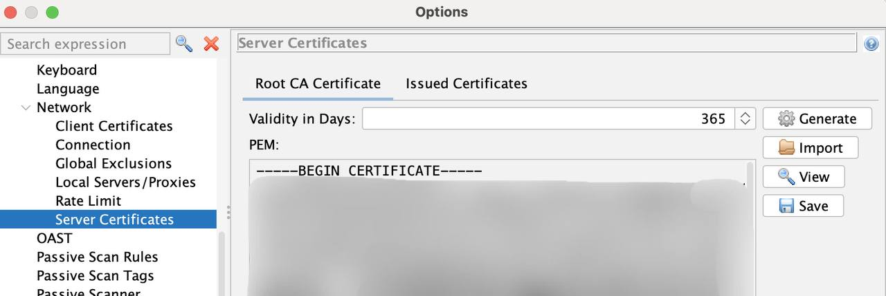<figcaption></figcaption></figure>

### **Просмотр сообщений** 

При появлении websocket, вкладка автоматически появляется в нижнем окне. Её можно закрепить нажав на скрепку.&#x20;

Здесь аналогично burp отображается все запросы во все сокеты, сокетам также присваивается свой id (тут называется **Channel**). Отличие от burp – показываются типы сообщений, а также PING и PONG сообщения.

При нажатии на сообщение тело откроется в окне сверху, можно также посмотреть в виде hex.

<figure>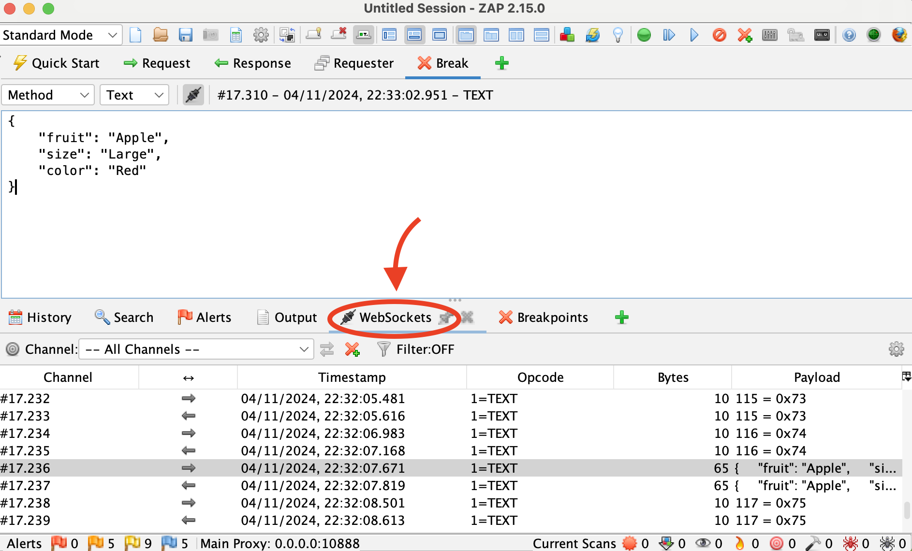<figcaption></figcaption></figure>

### **Перехват запросов**

Для перехвата нажимаем **пкм** на запросе и выбираем **break...**

Перед сохранением можно задать правила перехвата. Например, убрать конкретный канал, указать паттерн пайлоуда и выбрать какие входящие или исходящие сообщения перехватывать.

Поле **Payload Pattern** поддерживает регулярные выражения.

<figure>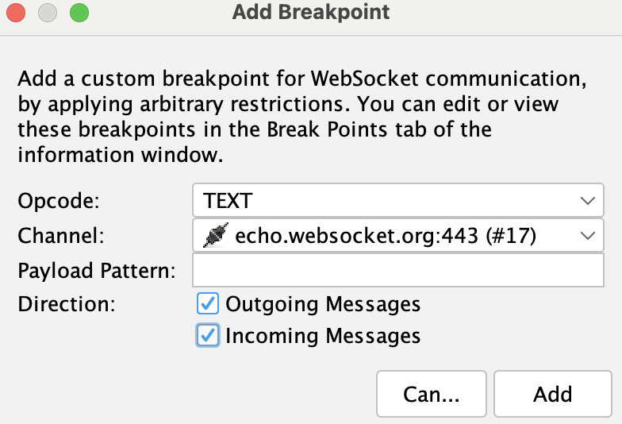<figcaption></figcaption></figure>

При перехвате, запрос появится в верхнем окне, здесь вы его можете модифицировать и отправить. Для **отправки** нажимаем любую стрелку 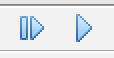(они хоть и подписаны по разному, но делают тоже самое, отличие только, если вы включили перехват всех запросов (), тогда при нажатии первой каждый следующий запрос перехватывается, при нажатии второй перехват всех запросов выключается.)

Чтобы удалить сообщение никуда не отправляя нажимаем перечёркнутый круг: 

– добавить новый брейкпоинт.

<figure>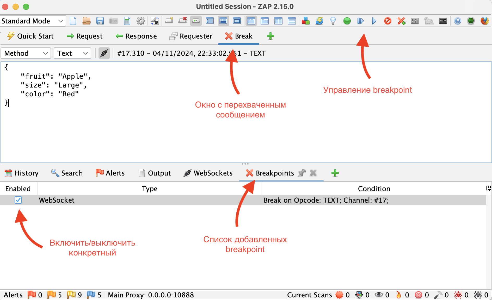<figcaption></figcaption></figure>

В нижней части экрана, во вкладке **Breakpoints**, можно управлять активными брейкпоинтами.

### **Отправка сообщений в WebSocket** 

Для открытия редактора сообщений нажимаем **пкм** на запросе и выбираем **Open/Resend with Message Editor** или из меню **Tools** > **WebSocket Message Editor.**

Здесь можно выбрать websocket в который отправлять сообщение и направление на клиент – **incoming**, на сервер – **outgoing**.

<figure>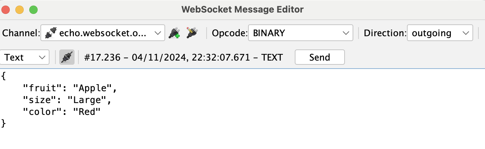<figcaption></figcaption></figure>

Отличие от Burp можно выбрать тип сообщения:

<figure><figcaption></figcaption></figure>
